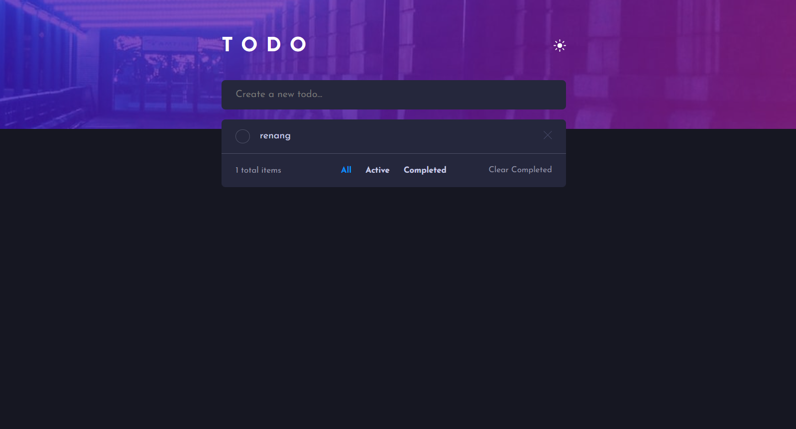

# Frontend Mentor - Todo app

## Welcome! 👋

A Todo List application built as part of a Frontend Mentor challenge.
This project focuses on implementing core todo functionalities, state management,
and user-friendly interactions using vanilla JavaScript.

## 🚀 Demo

Live demo: https://tinyurl.com/mrx6majv

## 💻 Run Locally

1. Clone the repo:
   git clone https://github.com/rifqysukabelajar/frontendmentor-challenges.git

2. Navigate to the project folder and open index.html in your browser.

## 🧩 Features

- Add todos – Quickly add new tasks with input validation.
- Delete todos – Remove tasks individually.
- Mark todos as completed – Track which tasks are done.
- Filter todos – View All, Active, or Completed tasks.
- Dark mode – Toggle between light and dark themes.
- Error handling – Shows a message when input is empty.

## 🛠️ Built With

- HTML5 – Semantic and accessible structure
- CSS – Flexbox, Grid, CSS Variables, and responsive design
- Mobile-first workflow
- Vanilla JavaScript – DOM manipulation, state management, localStorage

## 🧠 What I Learned

Code Organization

- Refactoring functions for reusability and maintainability
- Structuring JavaScript into multiple files based on responsibility (UI, services, utils)
- Organizing project folders for scalability

State Management

- Managing application state without frameworks
- Persisting state with localStorage
- Synchronizing UI with stored data

UX & UI

- Implementing input validation and error messages
- Building semantic and accessible HTML structure
- Enhancing user experience with dark mode and filters

Collaboration & Workflow

- Using Git and GitHub effectively
- Writing clear, specific commit messages

## 🚀 Future Improvements

- Add drag & drop to reorder todos
- Smooth UI animations

**Have fun building!** 🚀
