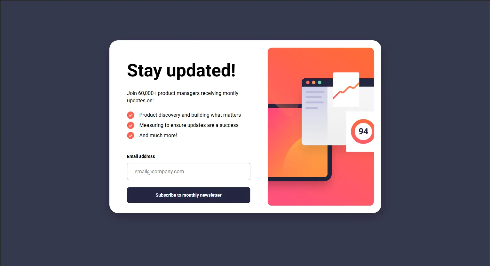
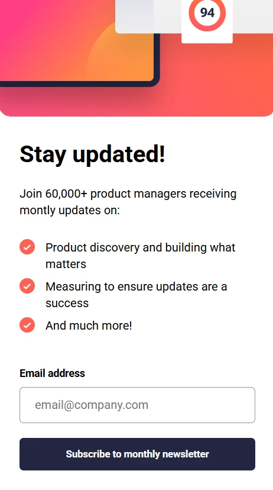

# Frontend Mentor - Newsletter sign up

## Welcome! 👋

Newsletter Sign-Up Form is a simple front-end development practice project with a focus on mobile-first design, UX, and performance. This project allows users to sign up for email addresses and displays a success message after the email address is validated.

## 🚀 Demo

Live demo: https://tinyurl.com/5aa3vzxx

## 💻 Run Locally

1. Clone the repo:
   git clone https://github.com/rifqysukabelajar/frontendmentor-challenges.git

2. Go to the challenge folder:
   cd frontendmentor-challenges/level-junior/newsletter-sign-up-with-success-message-main

3. Open index.html in your browser.

## 🧩 Features

- 📱 Mobile-First UI — mobile design first, then desktop.
- 📧 Email Validation — regex validation for correct email format.
- ✅ Success Message — redirect ke succeed.html jika email valid.
- 💾 Persistent Storage — user emails are stored in localStorage.
- 🧩 Modular JavaScript — JS functions are separated into different files for maintainability.
- 🎯 UX Enhancements — error messages appear prominently above the input.

## 🛠️ Built With

- HTML5 – Semantic and accessible structure
- CSS – Flexbox, Grid, CSS Variables, and responsive design
- Mobile-first workflow
- Vanilla JavaScript – DOM manipulation, localStorage, Page navigation

## 🧠 What I Learned

Code Organization

- Breaking functions into modules for reusability and maintainability
- Organizing JS folder structure according to responsibilities

LocalStorage & Navigation

- Storing user data without a state management library
- Using window.location.href to navigate between pages
- Checking for duplicate emails before saving

UX & UI

- Displaying clear error messages for invalid input
- Creating responsive and accessible forms
- Ensuring a smooth and user-friendly email signup flow

Collaboration & Workflow

- Using Git & GitHub to track progress
- Creating a neat and descriptive commit history

## 🚀 Future Improvements

- Display the success form without changing pages.
- Display a success toast or confirmation animation after submit.
- Add password and username input with security validation (min-length, uppercase, special chars).
- Show username in succeed page. example "Thanks, <username> for subscribing!"
- auto-login when user returns to the page.

**Have fun building!** 🚀
